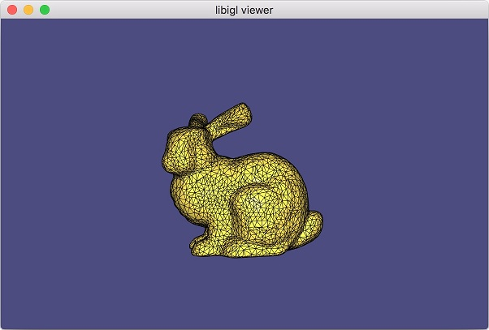

# libigl-Demo-Mac
It is a simple demo to display the mesh using the libigl(https://github.com/libigl/libigl) in macOS.

### Installation of the library
- sudo port install glfw eigen3

### Screen Shot

